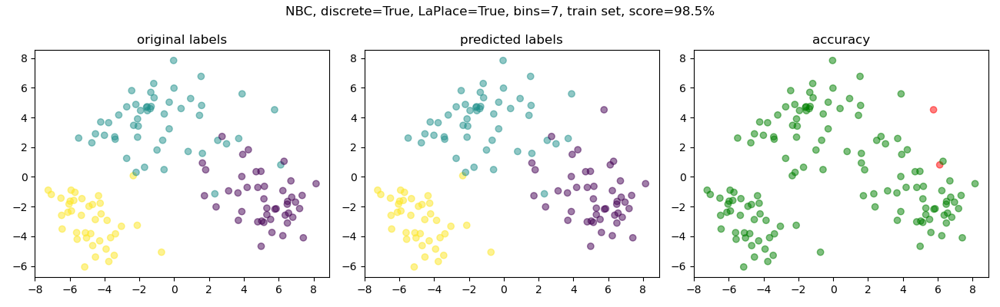
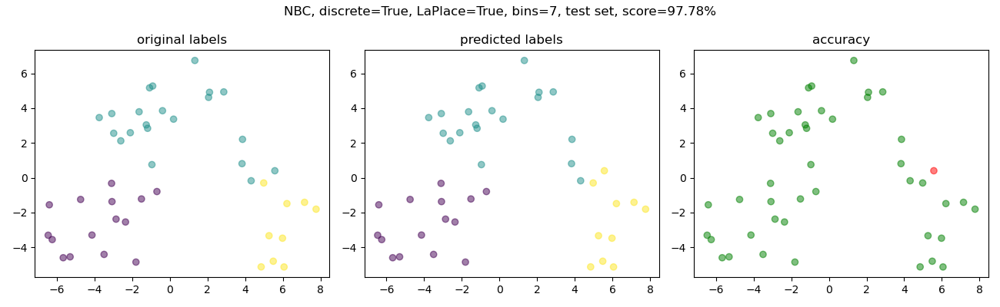
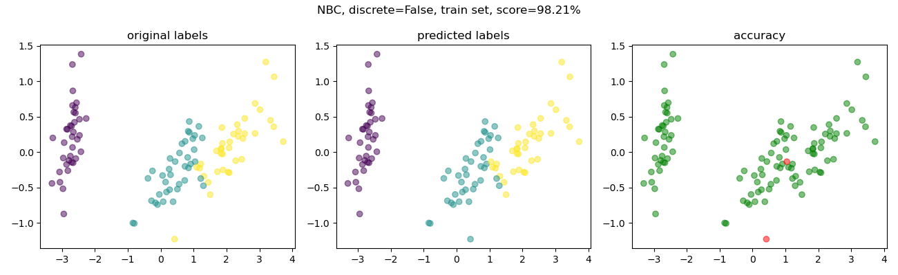
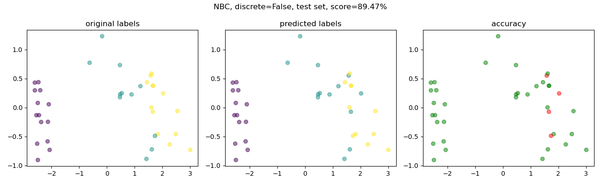

# Naive Bayes Classifier Implementation

## Table of Contents

- [Introduction](#introduction)
- [Naive Bayes Classifier](#naive-bayes-classifier)
- [Supported Models](#supported-models)
- [Optional Laplace and Log Fixes](#optional-laplace-and-log-fixes)
- [Example](#example)

## Introduction

This code provides an implementation of the Naive Bayes classifier for supervised learning tasks. The Naive Bayes classifier is a popular probabilistic algorithm known for its simplicity and effectiveness in solving classification problems.

## Naive Bayes Classifier

The Naive Bayes classifier is a probabilistic model based on Bayes' theorem. It assumes that the features (predictors) are conditionally independent given the class labels. Despite its "naive" assumption, the classifier performs remarkably well in various domains, especially for text classification and spam filtering.

## Supported Models

This implementation supports two types of Naive Bayes classifiers:

1. **Discrete Naive Bayes**: This model is suitable for datasets with categorical features. It calculates the probabilities of each class based on the frequency of feature occurrences.

2. **Continuous Naive Bayes**: This model is designed for datasets with continuous (real-valued) features. It estimates class probabilities using probability density functions, such as Gaussian distributions.

## Optional Laplace and Log Fixes

- **Laplace Fix**: When dealing with discrete data, you have the option to apply Laplace smoothing to handle cases where some feature values are missing in the training set. It prevents zero probability estimates.

- **Log Fix**: To avoid numerical underflow issues, you can choose to apply the log transformation to the probabilities during calculations.

## Example
For the purpose of demonstrating the usage ot the implementation, three well-known datasets were utilized as examples: the Iris dataset, the Wine dataset, and the Breast Cancer dataset.  

Example outcomes are shown below, including the results on the train and test set.

