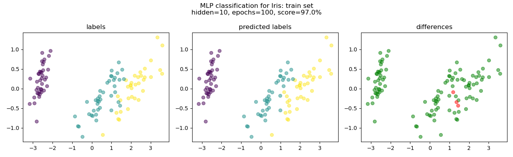
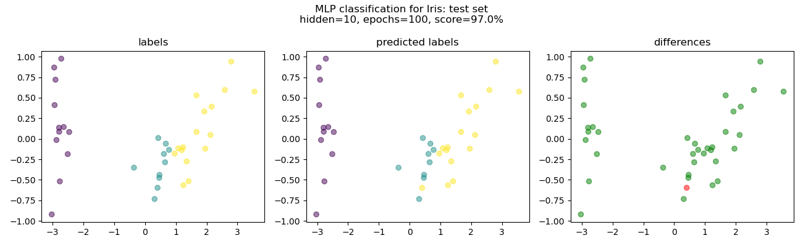
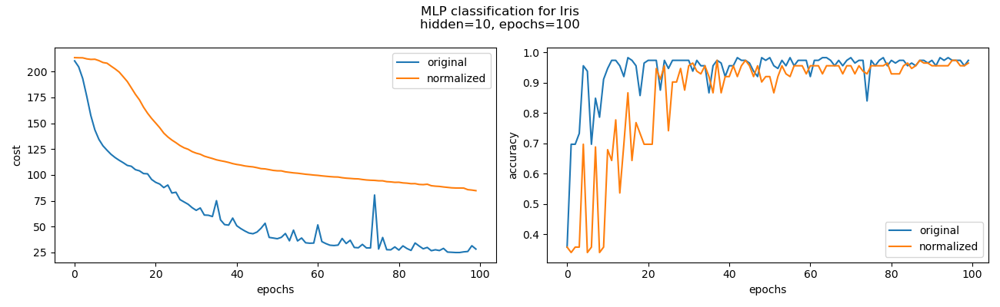

# Multi-Layer Perceptron (MLP) Analysis

## Table of Contents

   - [Introduction](#introduction)
   - [Features](#features)
   - [Example](#example)

## Introduction
This code contains a Python implementation of a Multi-Layer Perceptron (MLP) and its application on synthetic and real datasets. The MLP is a type of artificial neural network with multiple layers, allowing it to learn complex patterns and relationships in data. The code includes functionalities for fitting the MLP on datasets, making predictions, and visualizing the training process and classification results.

## Features

- The `MLP` class: This implementation provides an MLP model. You can specify the number of hidden layers, epochs, learning rate, and whether to shuffle the data during training.
- Data Preprocessing: The code uses scikit-learn's `datasets.make_classification()` function to generate synthetic datasets suitable for binary classification tasks.
- Visualization: The analysis includes various plots to visualize the training process, classification results, and learning curve.

## Example
In this analysis, the performance of the Multi-Layer Perceptron (MLP) is compared between the original dataset and the same dataset normalized, providing insights into the impact of data normalization on the MLP's classification results.

