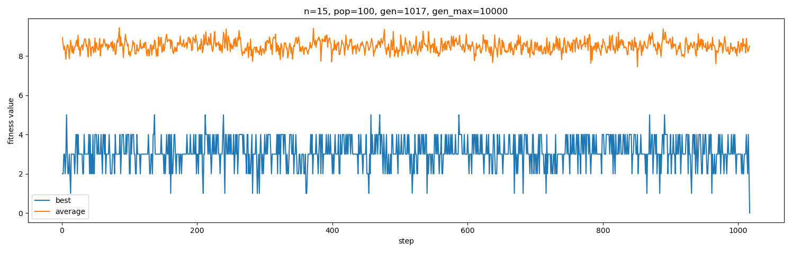

# N-Queens Genetic Algorithm

This code contains a Python implementation of the N-Queens problem using a genetic algorithm. The N-Queens problem is a classical combinatorial problem where the goal is to place N queens on an N×N chessboard in such a way that no two queens attack each other.

## Table of Contents
- [Introduction](#introduction)
- [Features](#features)
- [Example](#example)

## Introduction

Finding a valid arrangement of queens for large N becomes computationally expensive, and traditional brute-force methods may not be efficient. The genetic algorithm offers an alternative approach by simulating the process of natural selection to evolve solutions over multiple generations.

## Features
A generated state of the chessboard is referred to as specimen.
- Fitness Evaluation: Calculate the number of attacks on the board for each specimen, determining its fitness value.
- Population Evolution: The algorithm iteratively performs selection, crossover, and mutation operations to evolve the population and find optimal solutions.

## Example

The algorithm's performance is visualized using a plot that shows the fitness value (number of attacks on the board) over generations. The plot illustrates the improvement in fitness as the genetic algorithm evolves and progresses toward finding the optimal solution. Sample outcomes are presented below.

