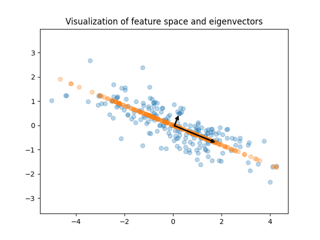
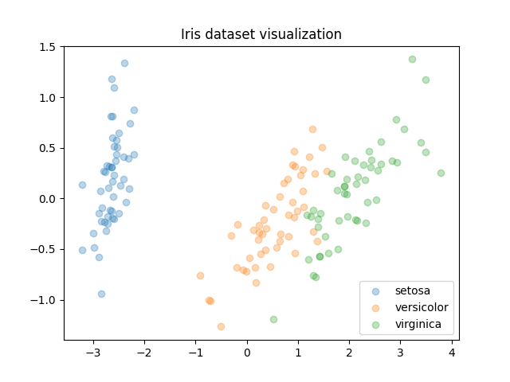
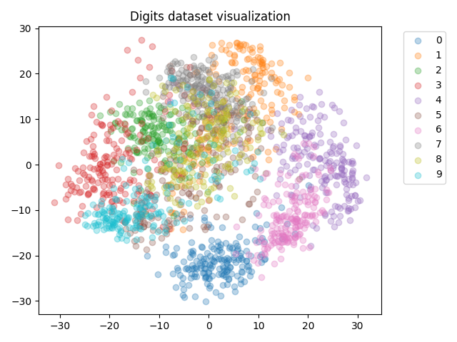
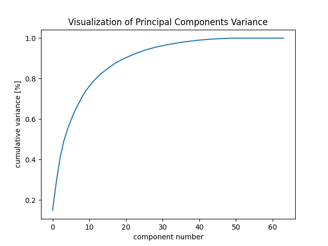
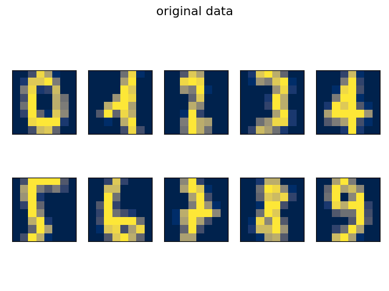
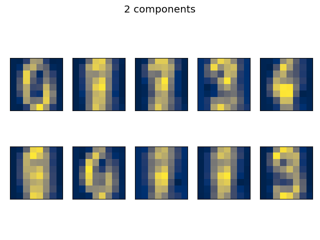
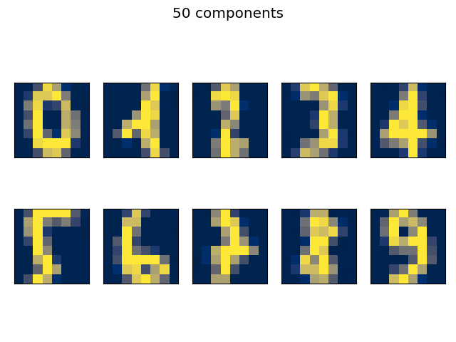
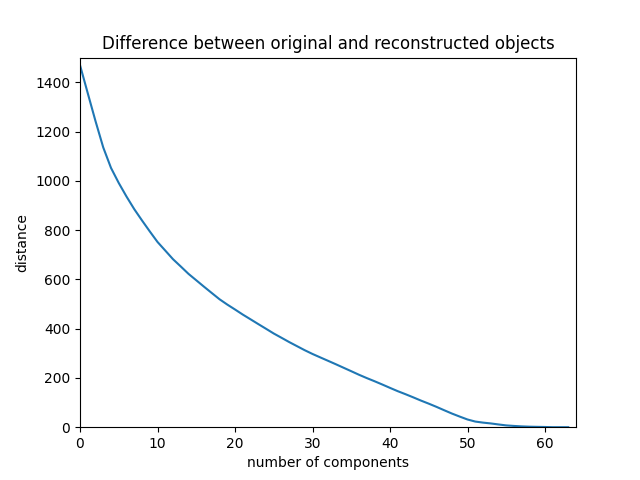

# PCA Visualization and Analysis

This code provides functions for performing Principal Component Analysis (PCA) on datasets, visualizing the results, and analyzing the variance captured by different numbers of principal components. PCA is a widely used technique in data analysis and dimensionality reduction, allowing us to extract essential features from high-dimensional data and visualize it in a lower-dimensional space.

The code demonstrates the functionality of PCA on different datasets. Here's a brief overview of the visualization and analysis performed in the code:

1. **Random Data Visualization**: The code generates random 2D data and visualizes it as a scatter plot. Then, it performs PCA to obtain the principal components and displays them as arrows indicating the direction of maximum variance.

2. **Iris Dataset Visualization**: The code loads the Iris dataset, performs PCA to reduce it to a 2D space, and visualizes the data points with different classes distinguished by colors.

3. **Digits Dataset Visualization**: The code loads the Digits dataset (handwritten digits), performs PCA to reduce it to a 2D space, and visualizes the data points with different digits distinguished by colors.

4. **Cumulative Variance Plot**: The code plots the cumulative variance captured by principal components to help identify the number of components needed to retain most of the variance in the data.

5. **Reconstruction of Digits**: The code performs PCA with varying numbers of components on the Digits dataset and reconstructs the original images from the reduced data. It visualizes the reconstructed images to show the effect of dimensionality reduction.

6. **Difference Analysis**: The code quantifies the difference between the original images and the reconstructed images by calculating the distance metric. It then plots the difference for different numbers of components, providing insights into the quality of reconstruction.

The code facilitates the understanding of PCA, its visualization capabilities, and its impact on data reconstruction with different numbers of principal components.
