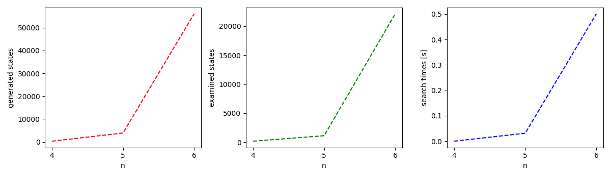

# N-Queens Problem Solver

## Table of Contents
- [Description](#description)
- [Example](#example)

## Description

This code aims to find a solution to the famous N-Queens problem using an algorithm implemented in Python. 

The N-Queens problem is a well-known combinatorial problem, where the goal is to find all possible arrangements of N queens on an NxN chessboard so that no two queens can attack each other. The challenge lies in finding a solution where no two queens share the same row, column, or diagonal.

This project provides a solution to the N-Queens problem using Breadth-First Search algorithm. The implementation is designed to handle various board sizes.

## Example

After running the script we are presented with the output containing the generated solution and statictics in a following format:

```commandline
┌───┬───┬───┬───┐
│   │ Q │   │   │
├───┼───┼───┼───┤
│   │   │   │ Q │
├───┼───┼───┼───┤
│ Q │   │   │   │
├───┼───┼───┼───┤
│   │   │ Q │   │
└───┴───┴───┴───┘
┌───┬───┬───┬───┬───┐
│ Q │   │   │   │   │
├───┼───┼───┼───┼───┤
│   │   │ Q │   │   │
├───┼───┼───┼───┼───┤
│   │   │   │   │ Q │
├───┼───┼───┼───┼───┤
│   │ Q │   │   │   │
├───┼───┼───┼───┼───┤
│   │   │   │ Q │   │
└───┴───┴───┴───┴───┘
┌───┬───┬───┬───┬───┬───┐
│   │ Q │   │   │   │   │
├───┼───┼───┼───┼───┼───┤
│   │   │   │ Q │   │   │
├───┼───┼───┼───┼───┼───┤
│   │   │   │   │   │ Q │
├───┼───┼───┼───┼───┼───┤
│ Q │   │   │   │   │   │
├───┼───┼───┼───┼───┼───┤
│   │   │ Q │   │   │   │
├───┼───┼───┼───┼───┼───┤
│   │   │   │   │ Q │   │
└───┴───┴───┴───┴───┴───┘
# of generated states for every n: [  341  3906 55987]
# of examined states for every n: [  200  1140 22092]
search times for every n: [0.01566648 0.02714682 0.54371953]
```
We are also presented with statistics in a graph form:
