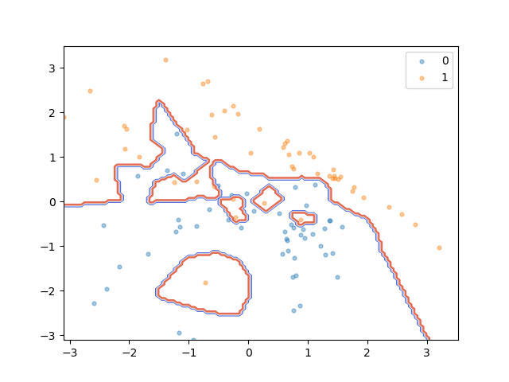
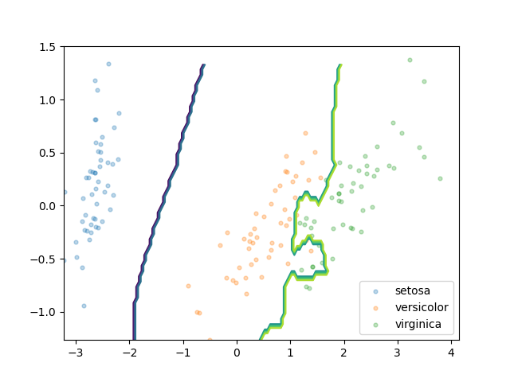
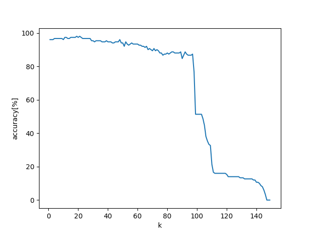
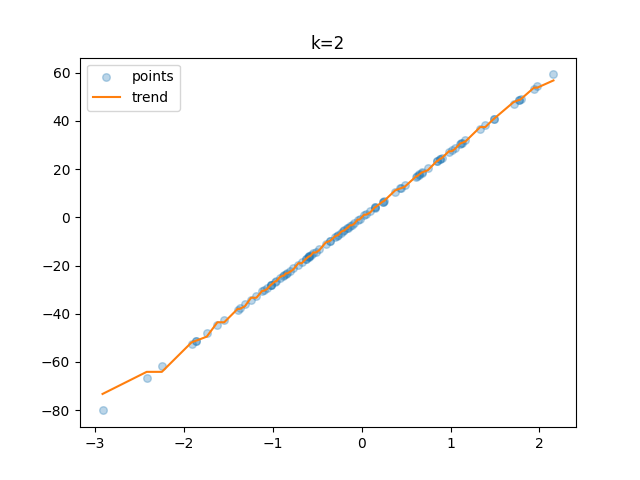
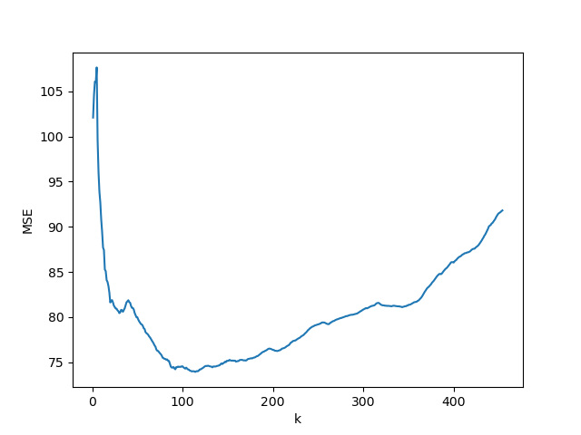

# k-Nearest Neighbors (k-NN) and PCA Visualization

This code provides implementations of k-Nearest Neighbors (k-NN) and Principal Component Analysis (PCA). It also demonstrates the visualization of data and separation boundaries in 2D space.

### Data Visualization and Separation Boundaries

The code includes examples of data visualization and separation boundaries in 2D space for two datasets: random data and Iris dataset.

#### Random Data Visualization and Separation Boundaries
The code generates random 2D data and visualizes it as a scatter plot. It uses k-NN to create separation boundaries for the data points.

#### Iris Dataset Visualization and Separation Boundaries
The code loads the Iris dataset, performs PCA to reduce it to a 2D space, and visualizes the data points with different classes distinguished by colors. It then applies k-NN to create separation boundaries in the PCA-transformed space.

### k-NN Performance Evaluation
The code demonstrates the use of k-NN for regression tasks. It fits k-NN on a random regression dataset and evaluates the performance with different values of `k`. It also applies k-NN to the Boston housing dataset and evaluates the Mean Squared Error (MSE) with different values of `k`.

The code provides insights into k-NN and PCA techniques, their visualization capabilities, and their application to datasets for classification and regression tasks.
