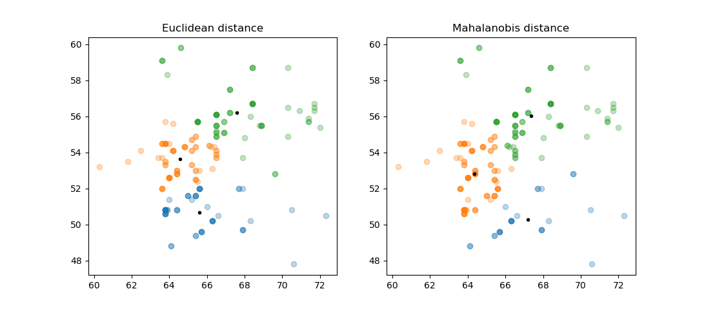

# K-means Clustering with Different Distance Metrics

This code provides an implementation of the K-means clustering algorithm using two different distance metrics: Euclidean distance and Mahalanobis distance. It also includes a function to calculate the accuracy of the clustering.

## Usage

1. The code loads data from the 'autos.csv' file containing 'width' and 'height' information.
2. It performs K-means clustering using both Euclidean and Mahalanobis distances, each with 3 clusters.
3. The cluster centers and data points are plotted for both distance metrics.
4. The accuracy of clustering is calculated and printed for both cases.

## Data Visualization

The code plots the K-means clustering results using `matplotlib`. In the figures, the cluster centers are shown as black dots, and the data points are scattered with different colors corresponding to different clusters.

### Note

Ensure that the 'autos.csv' file is present in the same directory as the script for successful data loading.

The code provides insights into the performance of K-means clustering with different distance metrics, demonstrating the impact of the choice of distance metric on clustering results.
