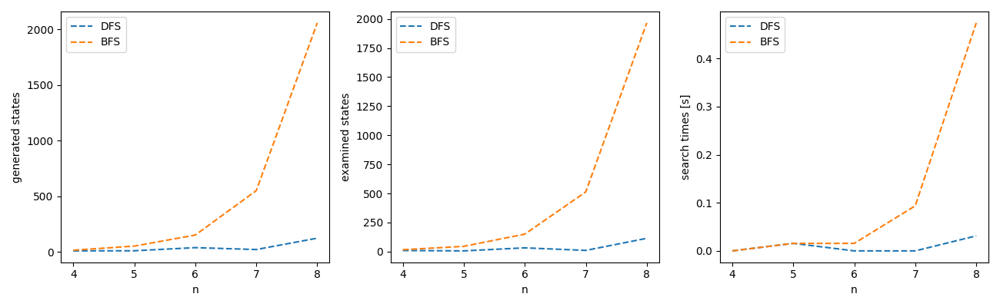

# N-Queens Problem Solver

## Table of Contents
- [Description](#description)
- [Example](#example)

## Description

This code aims to compare results of Depth-First Search and Breadth-First Search algorithms while solving the N-Queens puzzle.

## Example

After running the script we are presented with the output containing the generated solution and statictics in a following format:

```commandline
┌───┬───┬───┬───┐
│   │   │ Q │   │
├───┼───┼───┼───┤
│ Q │   │   │   │
├───┼───┼───┼───┤
│   │   │   │ Q │
├───┼───┼───┼───┤
│   │ Q │   │   │
└───┴───┴───┴───┘
┌───┬───┬───┬───┬───┐
│   │   │   │   │ Q │
├───┼───┼───┼───┼───┤
│   │   │ Q │   │   │
├───┼───┼───┼───┼───┤
│ Q │   │   │   │   │
├───┼───┼───┼───┼───┤
│   │   │   │ Q │   │
├───┼───┼───┼───┼───┤
│   │ Q │   │   │   │
└───┴───┴───┴───┴───┘
┌───┬───┬───┬───┬───┬───┐
│   │   │   │   │ Q │   │
├───┼───┼───┼───┼───┼───┤
│   │   │ Q │   │   │   │
├───┼───┼───┼───┼───┼───┤
│ Q │   │   │   │   │   │
├───┼───┼───┼───┼───┼───┤
│   │   │   │   │   │ Q │
├───┼───┼───┼───┼───┼───┤
│   │   │   │ Q │   │   │
├───┼───┼───┼───┼───┼───┤
│   │ Q │   │   │   │   │
└───┴───┴───┴───┴───┴───┘
┌───┬───┬───┬───┬───┬───┬───┐
│   │   │   │   │   │   │ Q │
├───┼───┼───┼───┼───┼───┼───┤
│   │   │   │   │ Q │   │   │
├───┼───┼───┼───┼───┼───┼───┤
│   │   │ Q │   │   │   │   │
├───┼───┼───┼───┼───┼───┼───┤
│ Q │   │   │   │   │   │   │
├───┼───┼───┼───┼───┼───┼───┤
│   │   │   │   │   │ Q │   │
├───┼───┼───┼───┼───┼───┼───┤
│   │   │   │ Q │   │   │   │
├───┼───┼───┼───┼───┼───┼───┤
│   │ Q │   │   │   │   │   │
└───┴───┴───┴───┴───┴───┴───┘
┌───┬───┬───┬───┬───┬───┬───┬───┐
│   │   │   │   │   │   │   │ Q │
├───┼───┼───┼───┼───┼───┼───┼───┤
│   │   │   │ Q │   │   │   │   │
├───┼───┼───┼───┼───┼───┼───┼───┤
│ Q │   │   │   │   │   │   │   │
├───┼───┼───┼───┼───┼───┼───┼───┤
│   │   │ Q │   │   │   │   │   │
├───┼───┼───┼───┼───┼───┼───┼───┤
│   │   │   │   │   │ Q │   │   │
├───┼───┼───┼───┼───┼───┼───┼───┤
│   │ Q │   │   │   │   │   │   │
├───┼───┼───┼───┼───┼───┼───┼───┤
│   │   │   │   │   │   │ Q │   │
├───┼───┼───┼───┼───┼───┼───┼───┤
│   │   │   │   │ Q │   │   │   │
└───┴───┴───┴───┴───┴───┴───┴───┘
# of generated states for every n: [ 11  12  40  23 125]
# of examined states for every n: [  9   6  32  10 114]
search times for every n: [0.         0.01568151 0.         0.         0.03123569]
┌───┬───┬───┬───┐
│   │ Q │   │   │
├───┼───┼───┼───┤
│   │   │   │ Q │
├───┼───┼───┼───┤
│ Q │   │   │   │
├───┼───┼───┼───┤
│   │   │ Q │   │
└───┴───┴───┴───┘
┌───┬───┬───┬───┬───┐
│ Q │   │   │   │   │
├───┼───┼───┼───┼───┤
│   │   │ Q │   │   │
├───┼───┼───┼───┼───┤
│   │   │   │   │ Q │
├───┼───┼───┼───┼───┤
│   │ Q │   │   │   │
├───┼───┼───┼───┼───┤
│   │   │   │ Q │   │
└───┴───┴───┴───┴───┘
┌───┬───┬───┬───┬───┬───┐
│   │ Q │   │   │   │   │
├───┼───┼───┼───┼───┼───┤
│   │   │   │ Q │   │   │
├───┼───┼───┼───┼───┼───┤
│   │   │   │   │   │ Q │
├───┼───┼───┼───┼───┼───┤
│ Q │   │   │   │   │   │
├───┼───┼───┼───┼───┼───┤
│   │   │ Q │   │   │   │
├───┼───┼───┼───┼───┼───┤
│   │   │   │   │ Q │   │
└───┴───┴───┴───┴───┴───┘
┌───┬───┬───┬───┬───┬───┬───┐
│ Q │   │   │   │   │   │   │
├───┼───┼───┼───┼───┼───┼───┤
│   │   │ Q │   │   │   │   │
├───┼───┼───┼───┼───┼───┼───┤
│   │   │   │   │ Q │   │   │
├───┼───┼───┼───┼───┼───┼───┤
│   │   │   │   │   │   │ Q │
├───┼───┼───┼───┼───┼───┼───┤
│   │ Q │   │   │   │   │   │
├───┼───┼───┼───┼───┼───┼───┤
│   │   │   │ Q │   │   │   │
├───┼───┼───┼───┼───┼───┼───┤
│   │   │   │   │   │ Q │   │
└───┴───┴───┴───┴───┴───┴───┘
┌───┬───┬───┬───┬───┬───┬───┬───┐
│ Q │   │   │   │   │   │   │   │
├───┼───┼───┼───┼───┼───┼───┼───┤
│   │   │   │   │ Q │   │   │   │
├───┼───┼───┼───┼───┼───┼───┼───┤
│   │   │   │   │   │   │   │ Q │
├───┼───┼───┼───┼───┼───┼───┼───┤
│   │   │   │   │   │ Q │   │   │
├───┼───┼───┼───┼───┼───┼───┼───┤
│   │   │ Q │   │   │   │   │   │
├───┼───┼───┼───┼───┼───┼───┼───┤
│   │   │   │   │   │   │ Q │   │
├───┼───┼───┼───┼───┼───┼───┼───┤
│   │ Q │   │   │   │   │   │   │
├───┼───┼───┼───┼───┼───┼───┼───┤
│   │   │   │ Q │   │   │   │   │
└───┴───┴───┴───┴───┴───┴───┴───┘
# of generated states for every n: [  17   54  153  552 2057]
# of examined states for every n: [  16   45  150  513 1966]
search times for every n: [0.         0.0156033  0.01560092 0.0937984  0.47421885]
```
We are also presented with statistics in a graph form, comparing the two approaches:
