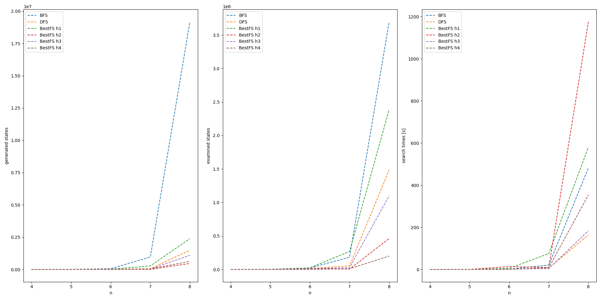

# N-Queens Problem Solver

## Table of Contents
- [Description](#description)
- [Example](#example)

## Description

This code extends the previous examples by a concept of heuristics and implements a Best-First Search approach to the N-Queens problem. It also allows comparing different approaches in terms of number of generated states, number of examined states and search times. 

## Example
The comparison is presented in a graphic form:
