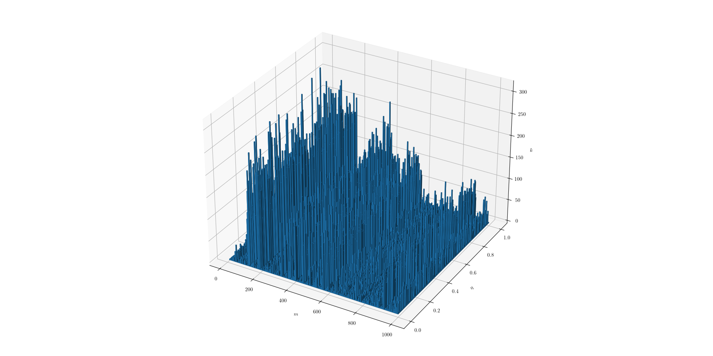
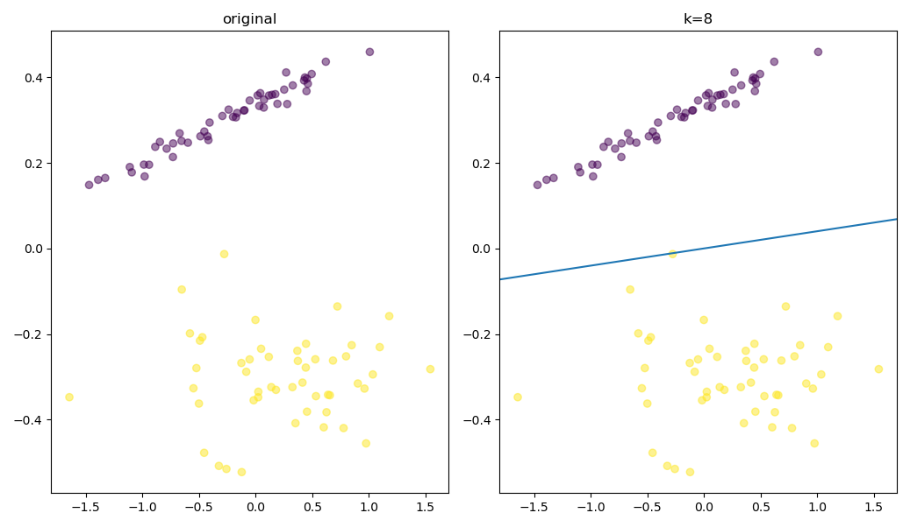

# Perceptron

## Table of Contents

- [Introduction](#introduction)
- [Dataset Generation](#dataset-generation)
- [Example](#example)

## Introduction

The Perceptron is a fundamental neural network model used for binary classification tasks. It learns to separate
linearly separable classes by adjusting its weights during the training process.

## Dataset Generation

Before exploring the perceptron algorithm, a synthetic dataset is generated. This dataset consists of linearly separable
data points in a 2D feature space, belonging to two distinct classes. These data points make it suitable for binary
classification tasks.

## Example
In this analysis, the Perceptron algorithm's performance is examined by varying two key hyperparameters: the number of data points (`m`) and the learning rate (`eta`). The `task2()` function is used to generate datasets with different numbers of data points (`m`) and train the Perceptron on each dataset with varying learning rates (`eta`). The number of iterations (`k`) required for the Perceptron to converge to a decision boundary is recorded for each combination.

The results are visualized using 3D bar graphs, illustrating how `m` and `eta` affect the number of iterations `k` needed for convergence. 

Additionally, two subplots show how the original dataset is classified by the Perceptron.

This analysis provides insights into how data size and learning rate impact the Perceptron's performance and convergence in binary classification tasks.

